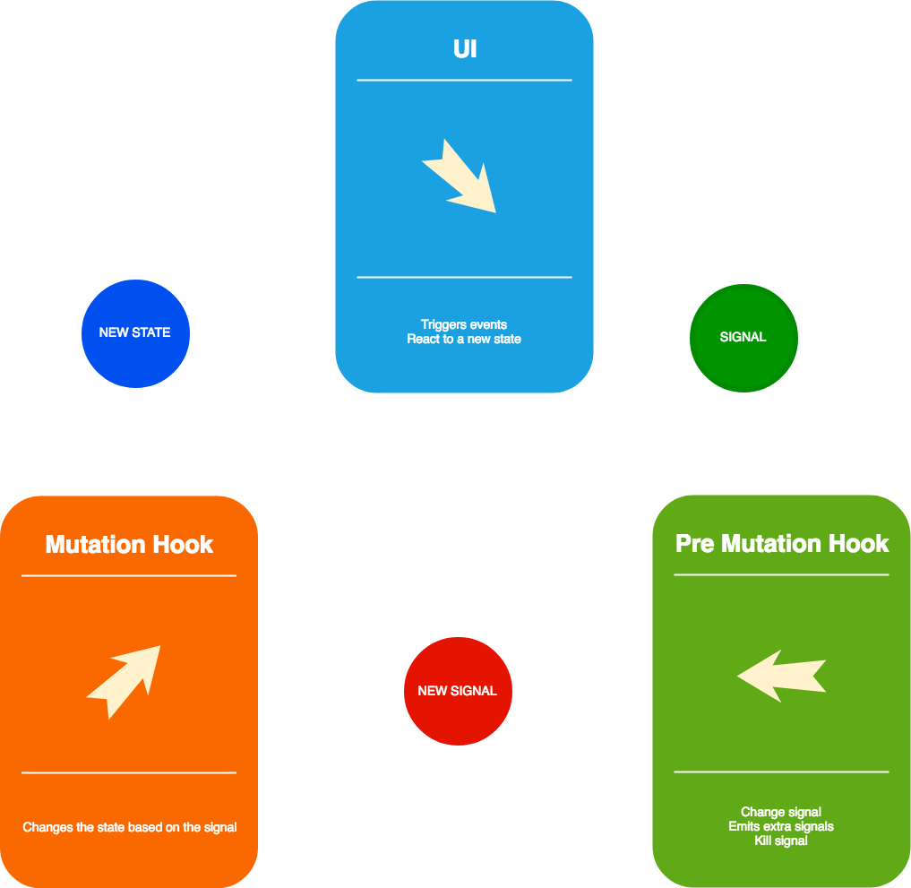

# eita
An attempt to do State management with Iterables.

This repo has a status of **an experiment**. It tries to prove a
the concept of creating central state management by leveraging on
Iterables, and by doing that, be able to do side effects management
out of the box  

## How it supposes to work? 

The core concept lies in three main actors:

- Premutation hooks
- Mutation Hooks
- Subscribers

Each one of these has different responsibilities.

### Pre mutation Hook.

The function hanging as a premutation hook receives
three parameters: 

1. The current dispatched signal (A.K.A action)
2. The current state
3. The dispatch function

This hook can do three actions:

1. Kill the signal, by returning `'kill'`.
2. Transform the signal, by returning a different signal: **This escapes the Pre Mutation hook step and sends the new signal to the Mutation hook step**
3. Dispatch new actions. You can think of this third case as your thunk/saga/side effects/async API call, etc...

### Mutation Hook

The function hanging as a mutation hook receives
two parameters: 

1. The current dispatched signal (A.K.A action)
2. The current state

This function should produce mutations on the state based on the signal received.

### Subscribers

This step is the last step of the processing pipeline where all the subscribers get notified of the changes. 

The function subscribed receives only the new state as a parameter.
